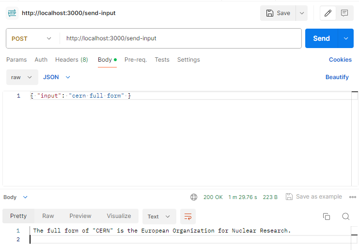

# Local LLM with RAG

## Requirements

- [Ollama](https://ollama.ai/) verson 0.1.26 or higher.

## Setup

1. Clone this repository to your local machine.

2. Install the required Python packages by running `pip install -r requirements.txt`.

## Running the Project

**Note:** The first time you run the project, it will download the necessary models from Ollama for the LLM and embeddings. This is a one-time setup process and may take some time depending on your internet connection.

The time taken to start the local LLM will depend on your hardware configuration. It make take 1 - 3 min to start

1. Ensure your virtual environment is activated or you can just install all the packages without making an environment.

2. Run the main script with `python app.py -m <model_name> -p <path_to_documents>` to specify a model and the path to documents. If no model is specified, it defaults to [orca-mini](https://ollama.com/library/orca-mini). If no path is specified, it defaults to `Research` located in the repository for example purposes.
3. Optionally, you can specify the embedding model to use with `-e <embedding_model_name>`. If not specified, it defaults to [nomic-embed-text](https://ollama.com/library/nomic-embed-text).

This will load the PDFs and Markdown files, generate embeddings, query the collection, and answer the question defined in `app.py`.

## Running the Project On Local Host
1. Express server files are within the root directory, so just ``npm i`` first, to install all the node modules and packages.

2. To start the server run ``node index.js``

3. Now, you have 2 routes to which you can send post request with a payload. It would be convenient to use Postman for this. 

## Usage
1. There are 2 routes - `start-process` and `send-input`

2. On localhost:3000/start-process, send a post request with the payload `{input: "<initial input>"}`. This route takes the initial input and starts the chatbot (i.e `app.py`)

3. The subsequent input will have to be sent to the localhost:3000/send-input route with the payload `{input: "<input>"}`

## Technologies Used

- [Langchain](https://github.com/langchain/langchain): A Python library for working with Large Language Model
- [Ollama](https://ollama.ai/): A platform for running Large Language models locally.
- [Chroma](https://docs.trychroma.com/): A vector database for storing and retrieving embeddings.
- [PyPDF](https://pypi.org/project/PyPDF2/): A Python library for reading and manipulating PDF files.

